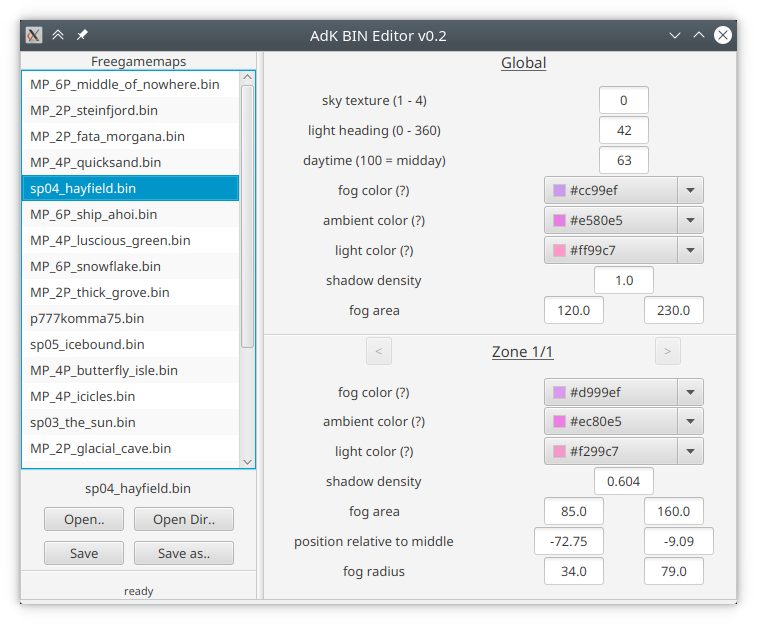

# AdK BIN Editor (WiP)
Editor for the `.bin` files of the maps of "Aufbruch der Kulturen".

**NOTE:** This software is still WiP.

## How to run

- you need at least Java 11 installed, **it will not run with Java 8**
- download the latest version from the GitHub [release page](https://github.com/zocker-160/AdK-BIN-Editor/releases)
- run it ;)

## Known Issues

- the color values are not displayed properly
